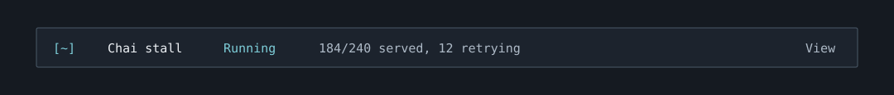

# Benchmark Chai Stall

Part of the [Workflow companions bundle](../README.md). Install the bundle
root once; this folder is not a separate plugin. Open `/chai`
to inspect this companion.



The preview illustrates an example state; it is not a live-session screenshot.

Have the runner write `.claude/companions/chai.progress.json`, or watch another
project-relative file:

```text
/chai watch output/evaluation/progress.json
/chai hide
/chai show
```

See `examples/chai.progress.example.json`. Required fields are `name`, `status`,
`completed`, `total`, and `heartbeat_at`. Optional `retrying` defaults to 0;
`stale_after_seconds` defaults to 300 and must be 10 to 86400. Counts must be
non-negative integers: completed cannot exceed total, and retrying cannot
exceed the unfinished count. `done` requires completed to equal total.

The runner supplies an actual UTC ISO timestamp ending in `Z`. Update it while
the worker is alive and write the file atomically, using a temporary file plus
rename. The example timestamp is illustrative; replace it with the current
time. A heartbeat reports liveness, not completed work. Chai shows both.

The feed refreshes every 15 seconds. A running job becomes Silent after the
configured heartbeat threshold. Paused, done, and failed jobs keep their own
states. A heartbeat over a minute into the future shows Clock? rather than
pretending the job is healthy. Invalid or missing watched feeds replace old
counts with a visible warning. The mod does not start, restart, or kill jobs.

For this repo, `.claude/companions/` is ignored. Add that ignore rule to other
repos using the default path, and ignore custom runtime output paths too.

## Files

- `model.ts`: this companion's pure logic and input validation.
- `model.test.ts`: focused tests for that logic.
- `examples/`: sample project inputs.
- `assets/preview.svg`: illustrative status row.

The shared [hook module](../hooks/register.tsx) handles SDK calls, commands,
refreshes, and the aligned strip / pane. Claude Code requires SDK-calling
helpers to be declared in the same hook module. Bundle integration tests live
in [tests/companions.test.ts](../tests/companions.test.ts).
