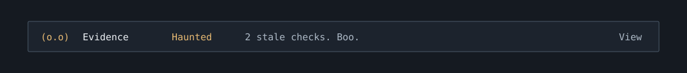

# Evidence Ghost

Part of the [Workflow companions bundle](../README.md). Install the bundle
root once; this folder is not a separate plugin. Open `/ghost`
to inspect this companion.



The preview illustrates an example state; it is not a live-session screenshot.

Recognizes simple foreground pytest, npm/pnpm/yarn/bun test and lint commands,
ruff checks, mypy, ty, tsc, Cargo checks/tests, Go tests, Claude plugin
validation/tests, and `git diff --check`. It deliberately skips compound shell
commands, help/list/collection modes, and backgrounded commands.

The six most recent distinct commands get separate receipts. Command identity
is hashed; the UI shows check families rather than recording the raw command.
Failed checks stay failed until that same command succeeds. A successful tool
result is marked fresh only when before/after worktree fingerprints agree and
no observed worktree change intervened. Checks that change the worktree are stale.

Edit/Write/NotebookEdit and Bash calls trigger a fingerprint comparison;
unchanged inputs keep passing receipts fresh, even if a command is not marked
read-only. Failed commands are inspected too, since they can leave partial
writes. Changed fingerprints invalidate passing receipts. The timer and each main
turn also inspect the Git worktree to catch external edits. Snapshots include
HEAD, staged and unstaged binary diffs, and untracked file contents. They cover
Git-visible files, not ignored dependencies, environment changes, remote
systems, or every possible input to a test. Reverting a file does not restore a
stale receipt; rerun the check.

To avoid retiring a check after unrelated edits, optionally create
`.claude/companions/evidence.json` in the project being checked:

```json
{
  "checks": [
    {
      "command": "uv run pytest -q",
      "inputs": ["src", "tests", "pyproject.toml", "uv.lock"]
    }
  ]
}
```

Commands match exactly after trimming outer whitespace. Inputs are literal
project-relative files or directories, not globs. Include source, tests,
configuration, fixtures, and dependency lockfiles that affect that check.
Unmatched commands still use the whole worktree. Scoped checks hash the names
and contents of Git-visible files under those paths, so unrelated edits or
commits do not retire them. New files, removals, content changes, and changes
to that check's configured scope do. Invalid configuration reports unknown.
The same 64-file / 2 MiB budget applies to each scope.

Scopes are supplied by the project; the ghost does not infer test dependencies.
It checks inputs before and after a run and on tool events / refreshes, rather
than continuously watching every write. A transient change reverted between
observations can be missed. Ignored files and environment changes remain outside
its coverage. A fresh receipt means unchanged observed inputs, not proof that
the selected scope covers every dependency.

Snapshots are bounded to 64 untracked files and 2 MiB of their content, with
three-second Git timeouts. Truncated diffs, unavailable Git, symlinks, or an
exceeded budget show unknown freshness instead of a green result. Raw source
contents are hashed in memory and never persisted by this mod. Check receipts
are session state; they are reset on clear/resume rather than borrowed from
another conversation. The ghost never runs tests itself.

## Files

- `model.ts`: this companion's pure logic and input validation.
- `model.test.ts`: focused tests for that logic.
- `examples/`: sample project inputs.
- `assets/preview.svg`: illustrative status row.

The shared [hook module](../hooks/register.tsx) handles SDK calls, commands,
refreshes, and the aligned strip / pane. Claude Code requires SDK-calling
helpers to be declared in the same hook module. Bundle integration tests live
in [tests/companions.test.ts](../tests/companions.test.ts).
