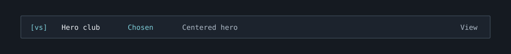

# Hero Fight Club

Part of the [Workflow companions bundle](../README.md). Install the bundle
root once; this folder is not a separate plugin. Open `/hero`
to inspect this companion.

The preview illustrates an example state; it is not a live-session screenshot.

Copy `examples/hero.example.json` to `.claude/companions/hero.json` in a project
that needs a comparison. Set `enabled` to false or remove that file to hide it.
Two to four variants require unique lowercase `id`, `label`, and `description`.
Optional `desktop` and `mobile` fields name project-relative PNG screenshot
paths. PNGs must be regular files within the project and at most 2 MiB each.

Terminal panes draw screenshots where the terminal supports images, with text
fallbacks otherwise. Desktop shows their file paths; open those files in your
usual image viewer. A supplied screenshot is not automatically reviewed or
scored. Use your existing capture/verification workflow to produce it.

In `/hero`, enter a short reason and press Enter, then choose a variant. The
choice and reason are saved to Claude's private plugin store per project.
They survive a new session, but changes to the comparison or screenshot
contents retire the choice. Copy decision puts the human-confirmed decision on
the clipboard for a handoff. It does not submit a prompt or edit the design.

## Files

- `model.ts`: this companion's pure logic and input validation.
- `model.test.ts`: focused tests for that logic.
- `examples/`: sample project inputs.
- `assets/preview.svg`: illustrative status row.

The shared [hook module](../hooks/register.tsx) handles SDK calls, commands,
refreshes, and the aligned strip / pane. Claude Code requires SDK-calling
helpers to be declared in the same hook module. Bundle integration tests live
in [tests/companions.test.ts](../tests/companions.test.ts).
